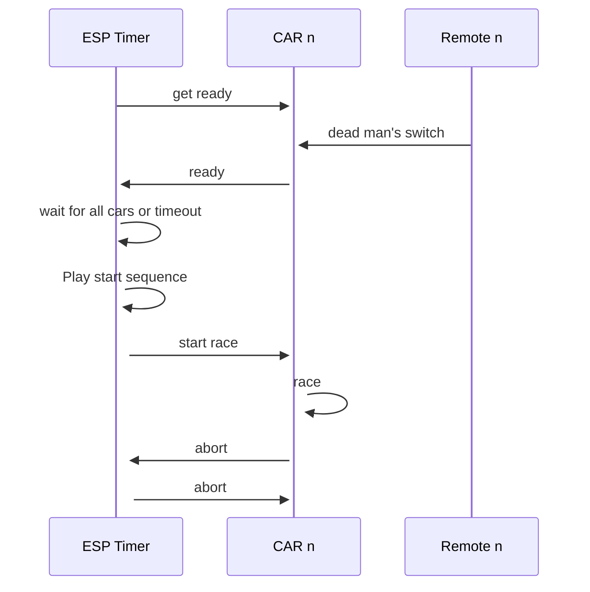

# lab_timer
The timer requires a supply voltage of 10 to 30 V

## Set up project
1. Install platformio in vscode
2. Open this repo with platfomio
3. Build the project

## Modes
Mentioned defines can be set in /lib/glob_defines/glob_defines.h
1. “Airplaine” mode
    - How to enter it: Press the button at the top when powering up or set AIRPLAINE_MODE true
    - The ESP will not connect to the WLAN and will not communicate with the cars.
    - Simply switch the car mode to active as well
2. Mode "Just toggle cars":
    - How to enter it: set JUST_TOGGLE_CARS true
    - If the cars are not able to communicate their progress or position, use this mode.
    - This mode assumes that the cars will not overtake each other.
    - The timers only switch when passing.
3. Drive with one car
    - Input: set the ID of CAR_B to -1
    - May only work in airfield mode. Not tested
    - Function get_car_on_finish_line() in main will always return CAR_A

## Communication
The cars and the lab timer communicate via web hooks.

## Dot Matrix Display (DMD)
This display is used to display the current lap time.
The display type is called HUB12 because it has only white leds.
### Useful links
- [HUB explanation](https://olympianled.com/led-hub-pinout-diagrams/)
- [Currently used matrix panel driver lib](https://github.com/Qudor-Engineer/DMD32/tree/main) KERNEL-VERSION NEEDS TO be @ 2.0.2
- [Alternative driver](https://github.com/adafruit/Adafruit_Protomatter/tree/master)
- [Pinout of the used DMD](https://cdn.shopify.com/s/files/1/0045/8932/files/DMDCON_DMDConnector.pdf?100730)
- ["User Manual"](https://cdn-reichelt.de/documents/datenblatt/A300/AD026_EN.pdf)
